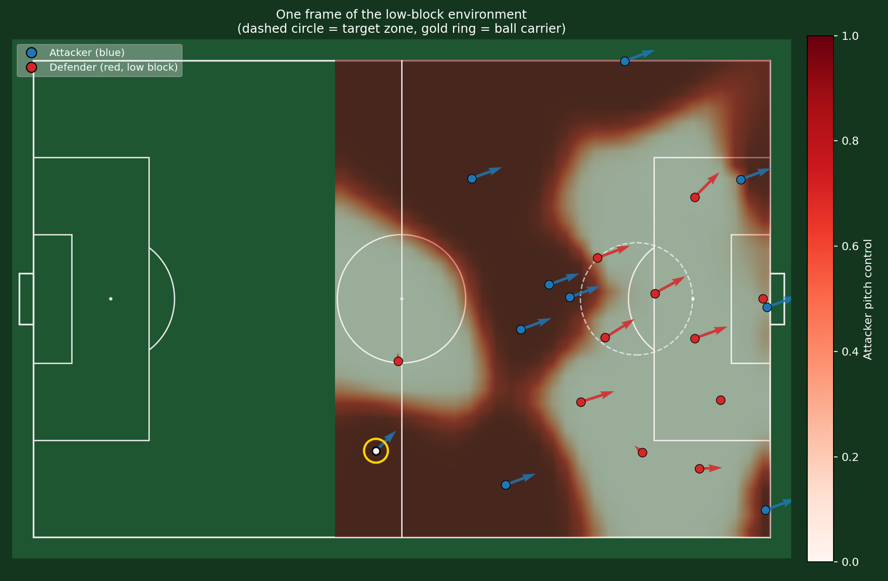
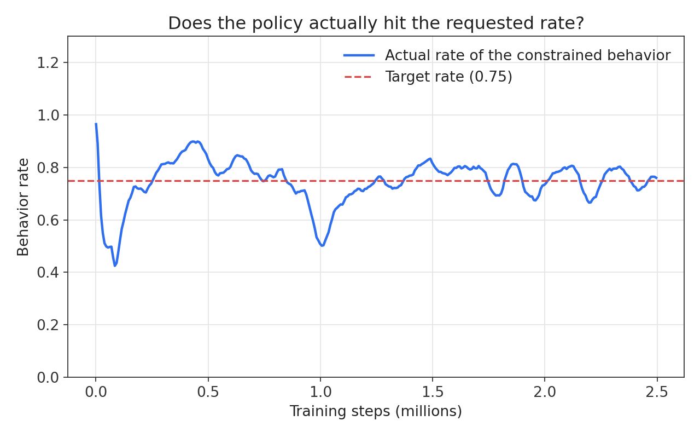
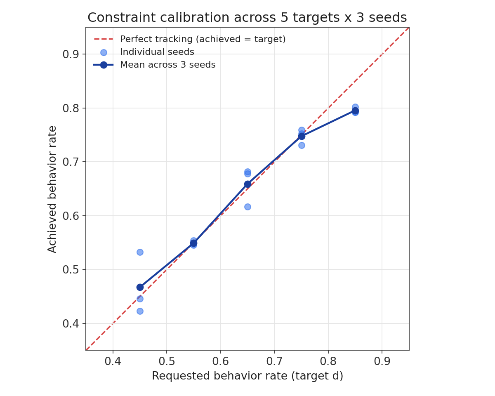
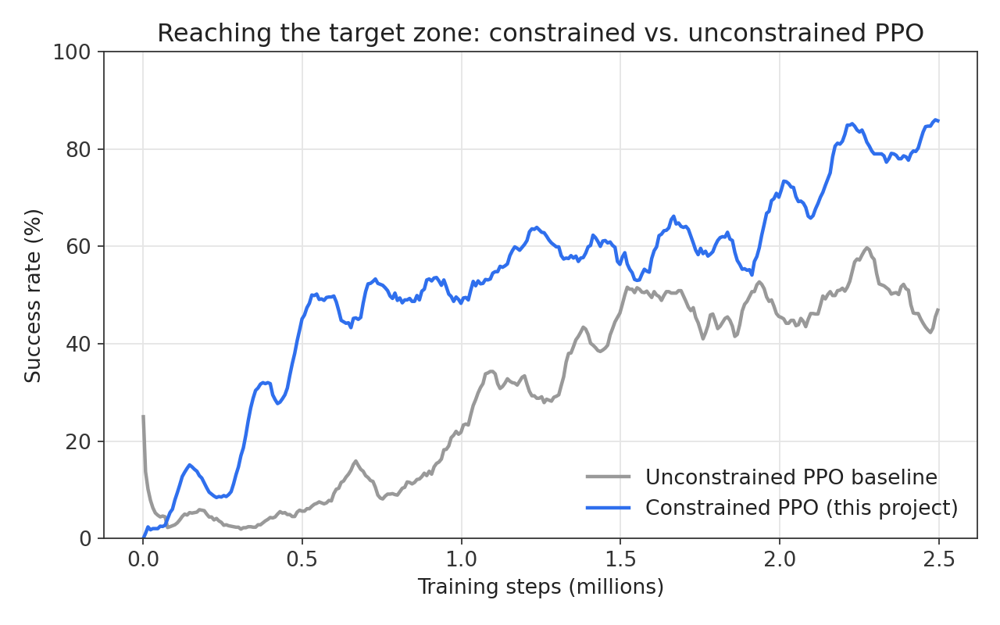
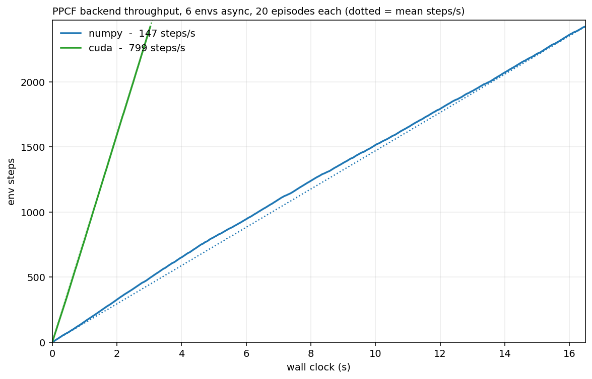

# haramball-hunter

An RL agent learning to break a "low block": the defensive wall a team packs in front of its own goal when it's up against a better opponent. Ten attackers, eleven defenders, real physics underneath. The attacking side gets no scripted help — it has to find its own way through.

The heatmap is attacker pitch control: how much of each patch of grass the attacking team effectively owns at that instant, computed from a physics model of how fast every player could reach and control the ball there. Dark red is safe attacking territory. The dashed circle is the zone the attackers are trying to break into.

## The actual problem

Normal reinforcement learning gives an agent one number to chase: win or lose, score or don't. That's fine until you want the agent to behave a certain way while it's doing that. Here I wanted the attackers to keep their shape and stay in control of the ball instead of just sprinting at goal and hoping, because a low block punishes chaos immediately.

So instead of one reward, the agent also gets a rule: keep your movement speed under control on at least 75% of ticks. That's a constraint, not a suggestion, and plain PPO has no idea what to do with a constraint. I implemented Lagrangian-constrained PPO (Roy et al., 2021), where the agent learns a second value function for how often it's breaking the rule, plus a multiplier that turns up the pressure automatically when it's misbehaving and eases off once it isn't. Nobody hand-tunes that tradeoff. It finds its own balance during training.

This is the part I actually care about. Learning some policy is easy. Learning a policy that holds a target rate, instead of drifting above it, below it, or ignoring it once reward pressure builds, is the harder claim, and it's the one this plot is checking.

One run at one target rate could just be luck, so I swept it: five different target rates (0.45 through 0.85), three seeds each, fifteen runs total.

If tracking were perfect every point would sit on the dashed line. Across the sweep the mean absolute gap between what I asked for and what the policy actually did is 2.75 percentage points. It also undershoots a bit at the high end (asked for 0.85, landed around 0.80 across all three seeds), which is a more honest result than a plot where everything lines up perfectly, and points at where the multiplier's learning rate probably needs tuning next.

## Does the constraint help, or just get in the way?

The obvious worry with bolting on a constraint is that it slows learning down or caps how well the agent ever performs. It didn't.

The constrained agent hits 80%+ success by 2.5M steps. An unconstrained baseline trained four times longer, 10M steps, tops out around 65-70%. Forcing the agent to stay organized turned out to be a better training signal than turning it loose, not a tax on performance.

## Physics, and making it fast

The pitch control model (Spearman et al., 2017, 2018) numerically integrates, for every player at every point on a grid, the probability they get there and control the ball first. That's a lot of small arithmetic, run every tick, across every environment training runs in parallel.

The NumPy version of this was the actual training bottleneck, not the RL itself. I rewrote it as a CUDA kernel in raw C++ through CuPy's RawKernel, keeping the NumPy version around as a reference to check against rather than throwing it away.

5.4x more environment steps per second. The two backends agree to within 0.0009 on every output, which is checked automatically on every run rather than eyeballed once.

## Everything else

Defender formations and marking behavior are calibrated against real match tracking data rather than hand-tuned, with a resampling procedure to check the fit holds on frames it never saw. Starting formations for both sides come out of a correlated-Gaussian model fit the same way. And because each attacker independently picks a direction, a speed, and (if it's holding the ball) a pass target every tick, the policy network is really making 30 correlated decisions per timestep across the team, not one.

## References

Spearman, W., Basye, A., Dick, G., Hotovy, R., & Pop, P. (2017). *Physics-Based Modeling of Pass Probabilities in Soccer.* MIT Sloan Sports Analytics Conference.

Spearman, W. (2018). *Beyond Expected Goals.* MIT Sloan Sports Analytics Conference.

Roy, J., Girgis, R., Romoff, J., Bacon, P.-L., & Pal, C. (2021). *Direct Behavior Specification via Constrained Reinforcement Learning.* arXiv:2112.12228