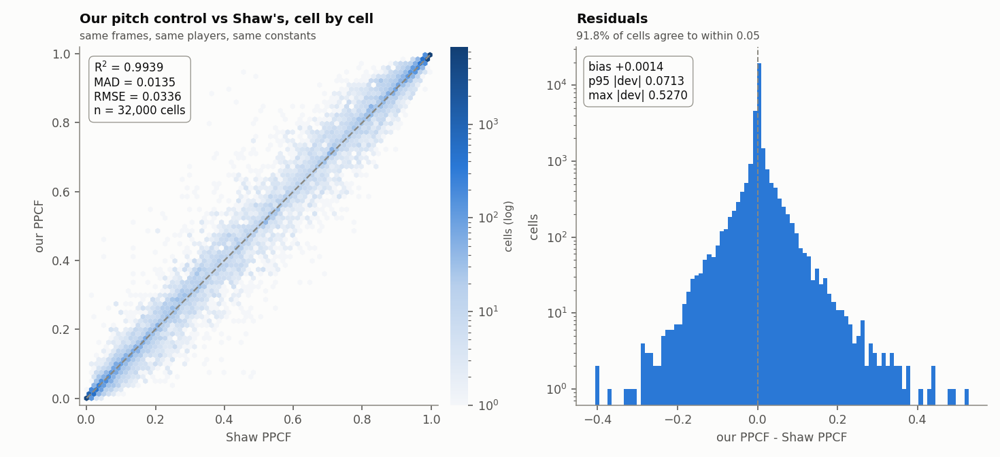
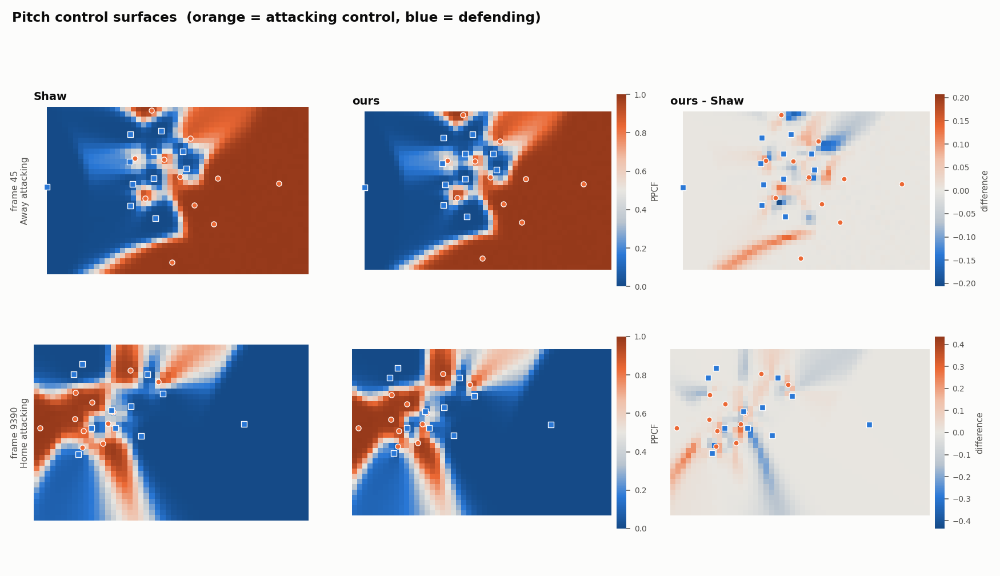
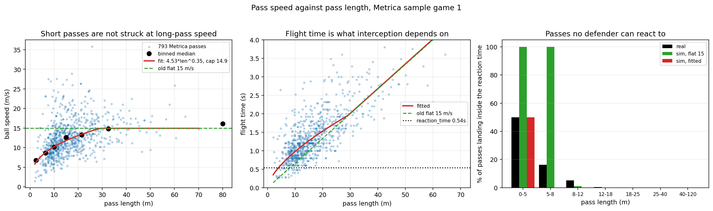

# Physics validation and calibration

Two studies live here, both against Metrica's public tracking data.

1. **PPCF validation** — checks `physics/ppcf.py` against an independent
   implementation of the same model. Everything from here to *Caveats*.
2. **Pass speed calibration** — fits `engine.pass_speed` to real pass flight
   times. Last section.

---

## PPCF validation against Laurie Shaw's implementation

`physics/ppcf.py` is a from-scratch pitch control model. This folder checks it
against an independent implementation of the same model — Laurie Shaw's
[LaurieOnTracking](https://github.com/Friends-of-Tracking-Data-FoTD/LaurieOnTracking)
`Metrica_PitchControl.py`, following Spearman (2018) — on real tracking frames.

## Running it

```bash
python physics/validation/ppcf_validation.py --download   # first time only, ~66 MB
python physics/validation/ppcf_validation.py              # 20 frames, ~2 min
python physics/validation/ppcf_validation.py --frames 40
python physics/validation/pass_speed_calibration.py       # offline, seconds
```

## Files

| File | What it is |
|---|---|
| `Metrica_PitchControl.py` | Shaw's model, **verbatim**. What we validate against. |
| `Metrica_IO.py` | Shaw's data loader, verbatim. |
| `Metrica_Velocities.py` | Shaw's velocity estimator, verbatim. Kept for reference — not imported, see caveats. |
| `ppcf_validation.py` | The PPCF experiment. |
| `pass_speed_calibration.py` | The pass-speed fit. |
| `data/` | Metrica's public sample data, downloaded on demand. |
| `results/` | CSVs and figures. |

## Method

20 pass events are sampled evenly across Metrica Sample Game 1. For each one,
both models are evaluated on the same 50x32 grid of points, with the same players,
at the same instant — 32,000 cells in total. We then scatter our attacking-team
control probability against his, cell by cell.

**Both models get the same constants.** Rather than typing them twice, the
parameter dict handed to Shaw's code is built directly from the constants in
`physics/ppcf.py` and `physics/tti.py`, so they cannot drift apart:

| Constant | Value | Read from |
|---|---|---|
| max player speed | 5.0 m/s | `tti.v_max` |
| reaction time | 0.54 s | `tti.reaction_time` |
| arrival-time sigma | 0.45 s | `tti.intercept_uncertainty` |
| λ attacking | 4.30 | `ppcf.attacker_control_rate` |
| λ defending | 7.40 (κ = 1.72) | `ppcf.defender_control_rate` |
| integration timestep | 0.08 s | `ppcf.integration_timestep` |
| integration horizon | 10 s | `ppcf.integration_horizon` |

Three features of Shaw's code have no counterpart in ours, so they are switched
off to keep the two looking at the same problem:

- **Goalkeeper λ boost.** He gives keepers 3x the control rate. We have no
  goalkeeper concept, so the keeper is just another defender.
- **Offside removal.** He can drop offside attackers from the calculation. We have
  no offside concept, so they stay in for both.
- **Ball travel time.** He starts the integral when the ball would arrive. We
  always start at t = 0 — `PPCF_grid`'s `ball_pos` argument only fills the
  `players['i_p']` interception cache that `turnover.py` reads, and never enters
  the integral. So Shaw is given `ball_start_pos=None`, which makes him do the
  same.

His head-start veto shortcut (which returns a hard 0 or 1 when one team arrives
far enough ahead) is also disabled, because we always run the integral.

## Results

20 frames, 32,000 cells:

| | |
|---|---|
| **R²** | **0.9939** |
| **Mean absolute deviation** | **0.0135** |
| RMSE | 0.0336 |
| Bias (ours − Shaw) | +0.0014 |
| p95 \|deviation\| | 0.0713 |
| max \|deviation\| | 0.5270 |
| cells agreeing within 0.05 | 91.8% |
| best fit | ours = 1.000 × shaw + 0.001 |

Per-frame R² ranges from 0.975 to 0.999.



The fit has slope 1.000 and essentially zero bias, so there is no systematic
stretch or offset between the two surfaces — the residuals are symmetric noise
around zero, and the difference maps show they sit in thin bands along the
boundaries between attacking and defending control, not in the settled areas.



**What the remaining 0.0135 is.** With every constant matched, one modelling
difference is left, and it is not something you can set with a parameter: how long
a player takes to reach a point.

- Shaw drifts the player at their current velocity for the reaction time, then
  runs them at top speed to the target. There is no acceleration limit, and
  turning around is free.
- We model acceleration explicitly (`a_max = 7 m/s²` in `physics/tti.py`),
  including braking and reversing when a player is moving away from the target.

Ours is the more conservative of the two: a stationary player needs ~0.2 s longer
to cover a moderate distance, and a player running the wrong way is penalised for
having to stop first. That shifts control boundaries by a fraction of a metre,
which is exactly where the residuals show up. The large `max |deviation|` values
are single cells sitting right on a boundary that the two models place slightly
differently.

## Outputs

| File | Contents |
|---|---|
| `results/ppcf_pointwise.csv` | Every cell: event, frame, x, y, both PPCF values, difference |
| `results/ppcf_per_frame.csv` | R², MAD and friends for each frame separately |
| `results/ppcf_summary.csv` | The overall numbers in the table above |
| `results/ppcf_scatter.png` | Scatter + residual histogram |
| `results/ppcf_surfaces.png` | Two example frames: his surface, ours, the difference |

## Caveats

- **Velocities use a moving-average smoother, not Savitzky-Golay.** Shaw defaults
  to Savitzky-Golay, which needs scipy; this repo does not depend on scipy, so the
  moving-average branch he also provides is used instead. Both models are fed the
  identical velocities, so this cannot tilt the comparison — it only shifts the
  common input slightly.
- **Four of Shaw's helpers are reimplemented.** `Metrica_IO` and
  `Metrica_Velocities` were written against pandas 0.x and call
  `Series.idxmax(2)`, which raises on pandas 2.x. `second_half_index`,
  the playing-direction flip, `calc_player_velocities` and `find_goalkeeper` in
  `ppcf_validation.py` are his logic with that fixed. `Metrica_PitchControl.py` —
  the model under test — is used exactly as he wrote it.
- **Frames in the first second of either half are skipped.** The velocity smoother
  has no history there, so every player reads as stationary — a data artefact
  rather than a state worth comparing on.
- **Shaw prints "Integration failed to converge" on a couple of cells.** With his
  veto shortcut disabled and a 0.08 s timestep, a few cells do not reach 0.99
  total probability inside the 10 s horizon. It is his own diagnostic, it affects
  a handful of cells out of 32,000, and our model stops at the same horizon.


---

## Pass speed calibration

`physics/engine.py` moved every pass at a flat `BALL_SPEED = 15.0` m/s. That is
about right for a 30m ball and roughly twice too fast for a 7m one, and the error
was not cosmetic.

**Why it mattered.** At 15 m/s a 7m pass is airborne for 0.46s, which is less than
the 0.54s `reaction_time` in `physics/tti.py`. The ball lands before any defender
has finished reacting to it, so `turnover.intercept_pass` can never fire on it
however well positioned the defence is. A learned attacker that recycles the ball
in short hops was therefore immune to interception **by construction rather than
by skill** — which is exactly the behaviour that prompted this study. Diagnostics
over 30 episodes against the 500k checkpoint: on the 988 flight ticks where a
defender *was* geometrically in range, the median pass was 6.9m with 0.23s of
flight left, against a defender time-to-intercept of 1.10s.

**Method.** Metrica logs Start Frame and End Frame for every pass at 25fps, so
flight time is directly measurable and speed does not have to be assumed. 793
passes after filtering. Fitted by least squares in log space, which is the right
error model for a multiplicative relationship:

```
speed = 4.5292 * length ** 0.3537,  capped at 14.93 m/s
```

The cap is the median speed of real passes over 25m. Without it the power law
keeps climbing past the point where real passers stop hitting the ball harder.
Fitted on period 1 and scored on period 2 — splitting by period rather than at
random, because passes inside one possession are near-duplicates.

**Results.**

| pass length | n | real speed | real flight | fitted speed |
|---|---|---|---|---|
| 0–5m | 20 | 6.74 m/s | 0.56s | 6.26 |
| 5–8m | 68 | 8.63 | 0.80 | 8.78 |
| 8–12m | 212 | 10.13 | 1.00 | 10.23 |
| 12–18m | 223 | 12.57 | 1.20 | 11.80 |
| 18–25m | 141 | 13.24 | 1.60 | 13.41 |
| 25–40m | 101 | 14.81 | 2.00 | 14.93 |
| 40m+ | 28 | 16.11 | 2.86 | 14.93 (capped) |

Passes airborne for less than the reaction time: **4.2% in reality, 11.4% under
the old flat speed, 1.3% under the fit**. In the 5–8m bin the old constant put
*100%* of passes inside the reaction window against a real 16%.



**Read the fit as a conditional median, not a per-pass prediction.** Held-out
per-pass skill against a constant-speed baseline is only **0.10** — speed at a
fixed length varies enormously and this model does not try to explain that
variance. Two reasons it is largely irreducible: a pass can be driven or rolled
over the same distance by choice, and Metrica's End Frame is when the receiver
*touches* the ball rather than when it arrives, so a receiver moving onto a pass
adds slack that reads as a slower ball. What the sim consumes is E[speed | length],
and on that the fit scores a trend RMSE of **0.57 m/s** against the binned medians,
versus **4.52 m/s** for the flat 15.

**Where it is used.** `engine.pass_speed` sets the per-tick step in
`ball_mechanics`, and `turnover.pass_speed` mirrors it so the defence's estimate
of remaining flight time matches the ball's actual flight time. The two sets of
constants must stay equal; `tests/test_pass_speed.py` asserts it, along with the
curve matching the measured medians and short passes outliving the reaction time.
Speed is derived from the frozen `flight_start`/`flight_target` rather than stored
on the ball, so a hand-built ball dict cannot fall out of step.

**Effect in the sim**, 40 episodes against the 500k checkpoint: interceptions rose
from 5 to 10, ground duels fell from 12 to 4 (the ball spends longer in the air
and less time at anyone's feet), and attacker successes fell from 9 to 5.

| File | Contents |
|---|---|
| `results/pass_speed_fit.png` | Speed and flight time against length, plus the reaction-time consequence |
| `results/pass_speed_by_length.csv` | Binned real medians against the fitted curve |
| `results/pass_speed_params.csv` | Fitted constants, held-out scores, reaction-time fractions |

**Caveat.** One match, 793 passes, one competition. The trend is strong and
physically unsurprising, but the constants are not claimed to three significant
figures for other leagues or eras.
